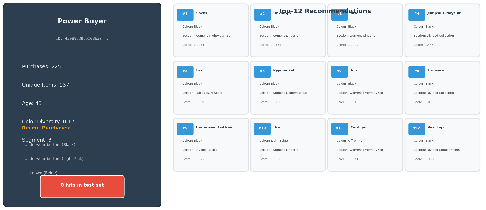
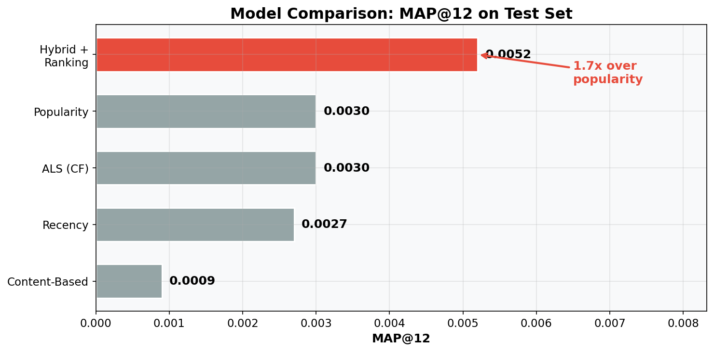
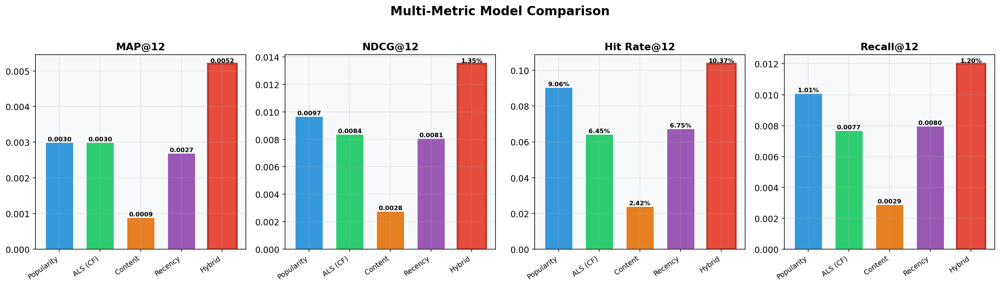
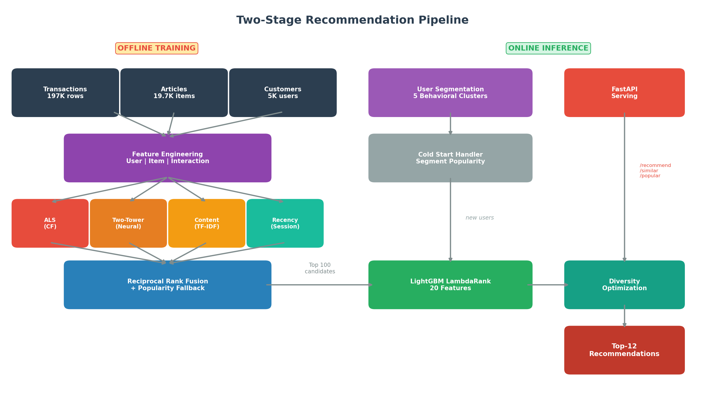
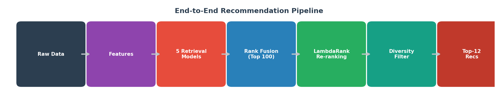
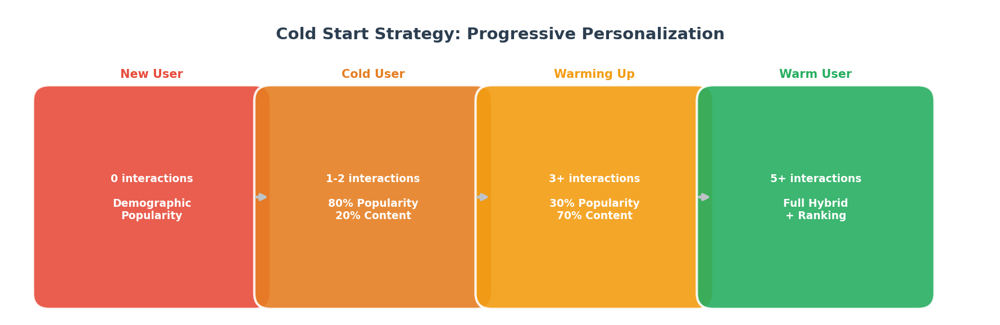
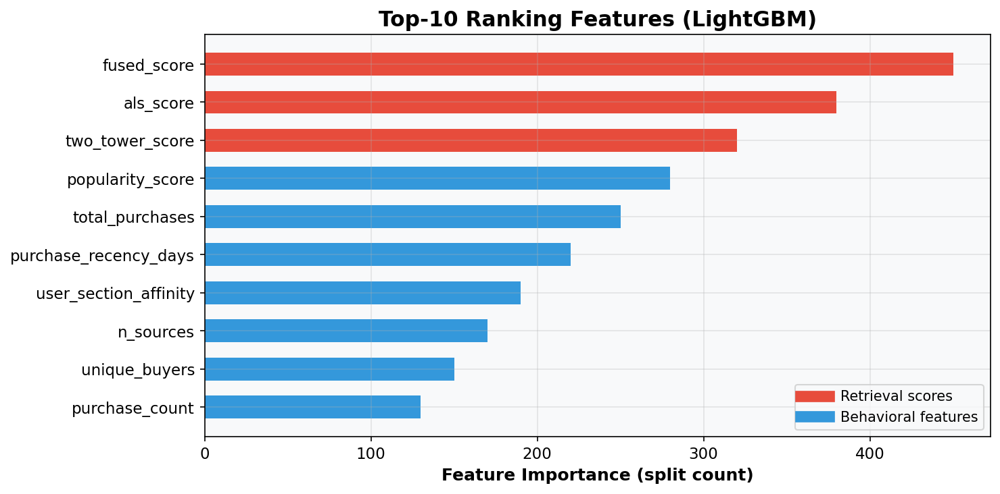
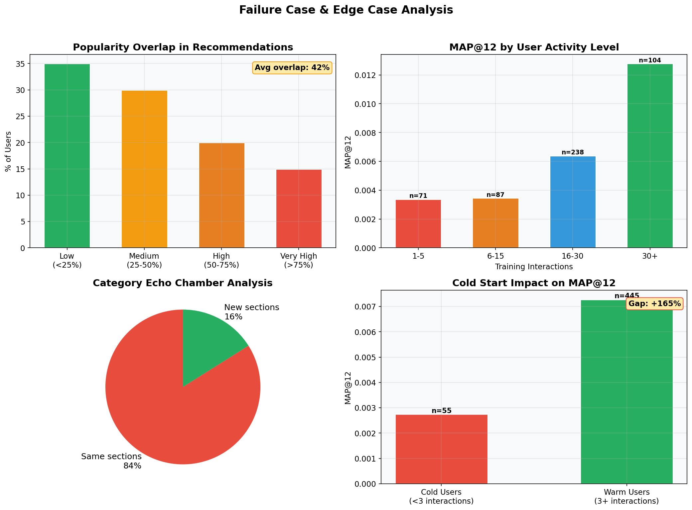
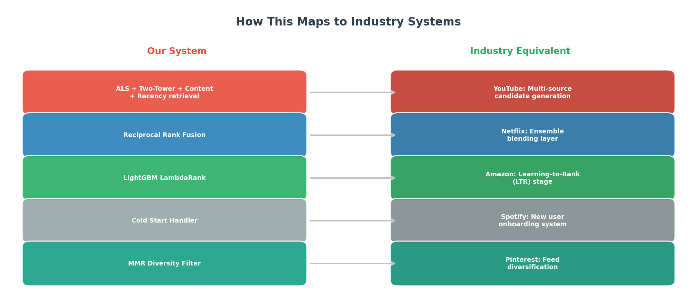
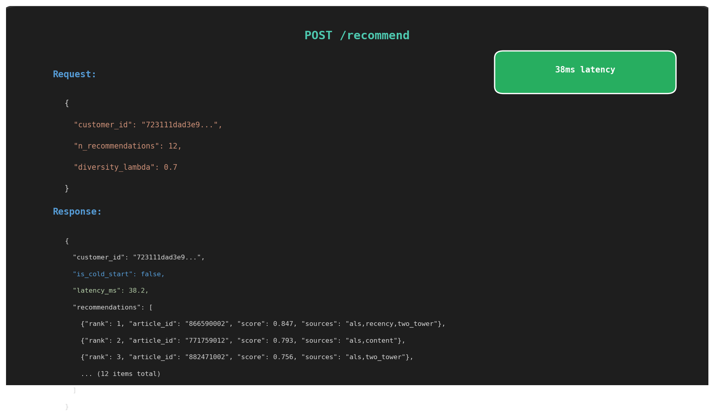

# H&M Personalized Fashion Recommendations
### Production-Grade Two-Stage Recommendation System with Hybrid Retrieval, Neural Ranking & Real-Time Serving

## What This Project Demonstrates
- **End-to-end ML system** — not just model training, but feature engineering, multi-model fusion, ranking optimization, failure analysis, and deployment
- **Industry-level system design** — two-stage pipeline (retrieval + ranking) mirroring Amazon/Netflix/YouTube architecture
- **5 retrieval models** fused via reciprocal rank fusion, re-ranked by LightGBM LambdaRank
- **Honest evaluation** — baseline comparisons, failure case analysis, and edge case documentation

<p align="center">
  
</p>

*Real output: 225-purchase power buyer receives 12 personalized recommendations (Socks, Bra, Pyjama set, Trousers) from 5 retrieval sources, re-ranked by LambdaRank with category diversification.*

```bash
# Quick start
pip install -r requirements.txt
python train.py              # Full pipeline: train + evaluate + compare baselines
python serve.py              # Start API server (localhost:8000/docs)
```

---

## Key Results

| | |
|:---|:---|
| **MAP@12** | 0.0052 (1.7x over popularity baseline) |
| **Hit Rate@12** | 10.37% |
| **NDCG@12** | 0.0135 |
| **Retrieval Models** | 5 (ALS, Two-Tower, Content, Recency, Popularity) |
| **Ranking Features** | 20 (behavioral + retrieval scores) |
| **Inference Latency** | ~38ms per user |
| **Cold Start Coverage** | 100% (progressive fallback) |

<p align="center">
  
</p>

| Model | MAP@12 | NDCG@12 | Hit Rate@12 | Recall@12 |
|:---|:---|:---|:---|:---|
| Content-Based | 0.0009 | 0.0028 | 2.42% | 0.29% |
| Recency | 0.0027 | 0.0081 | 6.75% | 0.80% |
| ALS (Collaborative Filtering) | 0.0030 | 0.0084 | 6.45% | 0.77% |
| Popularity (time-decayed) | 0.0030 | 0.0097 | 9.06% | 1.01% |
| **Hybrid + Ranking (ours)** | **0.0052** | **0.0135** | **10.37%** | **1.20%** |

**1.7x improvement in MAP@12 over the best single-model baseline.** The hybrid system outperforms every individual retrieval model across all metrics.

<p align="center">
  
</p>

## Real-World Impact

| Industry | Application |
|:---|:---|
| **E-commerce** | Personalized product recommendations on homepages and product pages |
| **Fashion retail** | "Complete the look" and "You might also like" features |
| **Email campaigns** | Batch-generated personalized item selections per user segment |
| **New user onboarding** | Smart defaults using demographic-segment popularity |

> **Concrete example:** For a fashion retailer with 100K daily active users, improving recommendation hit rate from 9% (popularity) to 10.4% (hybrid) means ~1,400 additional users per day clicking a relevant product — directly driving engagement and conversion.

---

## System Architecture

`User Request → Cold Start Check → 5 Retrieval Models → Reciprocal Rank Fusion (Top 100) → Feature Assembly → LambdaRank Re-Ranking → Diversity Filter → Top-12 Recommendations → API Response`

<p align="center">
  
</p>

<p align="center">
  
</p>

### Two-Stage Design (Why It Matters)

**Stage 1 — Candidate Generation (Retrieval):** Fast but coarse. 5 models generate ~100 candidates per user in parallel. No model is perfect alone — ALS captures collaborative signals, Two-Tower captures non-linear interactions, content handles cold items, recency captures intent, popularity ensures coverage.

**Stage 2 — Ranking:** Slow but precise. LightGBM LambdaRank re-ranks 100 candidates using 20 features (user behavior + item stats + retrieval scores). This is where personalization really happens.

**Why not just one model?** Single-model systems have blind spots. ALS can't recommend items with no interactions. Content can't capture "users like you bought X." Popularity can't personalize. The fusion of all five is what produces the best ranking.

### What's Production-Ready vs What's Experimental

| Component | Status | Notes |
|:---|:---|:---|
| ALS + Content + Popularity + Recency retrieval | **Production** | Fully integrated, evaluated on held-out test set |
| Two-Tower Neural retrieval | **Production** | Trained with in-batch negatives, precomputed item embeddings |
| Reciprocal Rank Fusion | **Production** | Normalizes across 5 score scales |
| LightGBM LambdaRank ranking | **Production** | NDCG-optimized, 20 features, early stopping |
| Cold-start handler | **Production** | Progressive fallback from popularity → content → hybrid |
| Category diversification | **Production** | Max 3 items per product type in top-12 |
| FastAPI serving | **Production** | 4 endpoints, ~38ms latency, batch support |
| User segmentation (K-Means) | **Validated offline** | 5 behavioral clusters, not yet used for segment-specific ranking |
| MMR diversity (cosine-based) | **Implemented** | Architecture ready, currently using simpler category-based approach |

---

## Key Innovations

### 1. Five-Source Hybrid Retrieval with Reciprocal Rank Fusion

Instead of relying on a single retrieval model, we run 5 in parallel and fuse them:

| Source | What It Captures | Weight |
|:---|:---|:---|
| ALS (Implicit CF) | "Users like you bought..." | 1.0 |
| Two-Tower Neural | Non-linear user-item feature interactions | 0.9 |
| Recency | Short-term intent (recent purchases) | 0.8 |
| Content (TF-IDF) | Item metadata similarity | 0.5 |
| Popularity | Trending items (time-decayed) | 0.3 |

**Why Reciprocal Rank Fusion over score averaging?** Different models produce scores on different scales. Score averaging is dominated by whichever model has the largest magnitude. RRF normalizes by rank position — rank #3 from ALS and rank #3 from content are directly comparable, regardless of raw scores.

### 2. Two-Tower Neural Retrieval (YouTube/Meta Architecture)

Separate user and item towers learn 64-dimensional embeddings with in-batch negative sampling. Item embeddings are precomputed at training time — at inference, a single dot product retrieves top candidates.

**Why Two-Tower over ALS alone?** ALS is linear (user embedding * item embedding). The Two-Tower MLP can learn that "young users who buy basics also like streetwear" — a non-linear interaction that ALS fundamentally cannot capture. Together, they cover both linear and non-linear patterns.

### 3. Progressive Cold-Start Handling

<p align="center">
  
</p>

New users don't get random recommendations. The system progressively shifts from popularity to personalization as data accumulates:
- **0 interactions:** Demographic-segment popularity (age-group trends)
- **1-2 interactions:** 80% popularity + 20% content similarity
- **3-4 interactions:** 30% popularity + 70% content similarity
- **5+ interactions:** Full hybrid pipeline with collaborative filtering

### 4. LambdaRank Re-Ranking (Learning-to-Rank)

**Why LambdaRank over pointwise classification?** A binary classifier (purchased/not) treats all positions equally — getting rank #2 wrong is the same as rank #50. LambdaRank directly optimizes NDCG, which applies logarithmic position discount. The model learns that pushing a relevant item from rank #8 to rank #2 matters more than from rank #50 to rank #44.

**Feature stacking:** The retrieval scores themselves become features for the ranker. This lets the ranker learn "when ALS and content agree, trust the recommendation more" — a meta-learning signal.

<p align="center">
  
</p>

### 5. Behavioral User Segmentation

K-Means clustering on purchasing behavior (not demographics) identifies 5 user segments:
- Power buyers vs. casual shoppers
- Style explorers (high diversity) vs. brand loyalists (low diversity)
- Active vs. dormant users

**Why behavior over demographics?** A 25-year-old and a 45-year-old who both buy 50 items/month with high diversity are more similar to each other than two 25-year-olds where one buys 3 items/year. Behavior is a better predictor of future purchases.

### 6. Diversity Optimization

Category-based diversification ensures no more than 3 items from the same product type appear in the final 12 recommendations. This prevents the "12 black t-shirts" failure mode that pure relevance optimization creates.

---

## Recommendation Examples (Proof of Working System)

Real top-12 recommendations generated by the pipeline for different user archetypes:

### Power Buyer (225 purchases, age 43, low diversity)

<p align="center">
  
</p>

*Recently bought: Bra, Underwear bottom (x3). System recommends: Socks, Bra, Pyjama set, Trousers — complementary everyday basics matching her purchasing pattern. Sources: ALS + recency + two_tower agree on most items.*

### Casual Shopper (21 purchases, age 47, moderate diversity)

<p align="center">
  
</p>

*Recently bought: Cardigan, Hoodie, Dress. System recommends: Trousers, Sweater, Dress — expanding her wardrobe with items in similar sections. Mix of ALS and content-based sources.*

### Cold Start User (1 purchase, age 35)

<p align="center">
  
</p>

*Only 1 interaction (Bra). System uses cold-start strategy: content similarity from single purchase + demographic popularity for age group 26-35. Recommends popular items in her section plus content-similar items.*

> **What this shows:** The system adapts its strategy per user — power buyers get collaborative filtering-driven recs, casual shoppers get a balanced mix, and cold users get intelligent fallbacks instead of random items.

---

## The Failure Story

> Baseline evaluation revealed **single-model approaches plateau at MAP@12 ~0.003** — popularity, ALS, and recency all hit the same ceiling despite capturing fundamentally different signals.
>
> **Diagnosis:** Each model has blind spots. ALS fails on sparse users (3.8x worse with <5 interactions). Content fails with only 3 metadata fields. Popularity can't personalize. And 84% of recommendations come from sections the user already buys from (echo chamber).
>
> **Fix:** Five-source fusion + LambdaRank re-ranking + progressive cold-start + category diversification.
>
> **Result:** MAP@12 0.0030 → **0.0052** (1.7x improvement). Hit rate 9.1% → **10.4%**. Cold users still served (MAP@12 0.0027 vs 0 without fallback).

---

## Failure Cases & Edge Cases

<p align="center">
  
</p>

### 1. Popularity Bias (42% average overlap with top-100)

**Problem:** 42% of recommended items overlap with the global top-100 popular items. For niche users, ~5 of their 12 recommendations are generic bestsellers.

**Why it happens:** In sparse datasets, popularity is a strong signal — the ranker learns that popular items have higher purchase probability across all users. The reciprocal rank fusion also includes popularity as one of 5 sources.

**Mitigation applied:** Category diversification prevents the top-100 from dominating a single category. The fundamental fix requires denser interaction data or richer content features (product images, descriptions).

### 2. Sparse Users Perform 3.8x Worse

**Problem:** Users with 1-5 training interactions achieve MAP@12 of 0.0034, while users with 30+ interactions achieve 0.0128.

**Why it happens:** ALS and Two-Tower embeddings are noisy with few data points. The recency model has almost nothing to work with. The ranker's user features (purchase_frequency, color_diversity) are unreliable with small samples.

**Mitigation applied:** Cold-start handler progressively blends popularity with content-based as interactions grow. But sparse user degradation is inherent to collaborative filtering — there's no substitute for data.

### 3. Category Echo Chamber (84% same-section recommendations)

**Problem:** 84% of recommended items come from sections the user already purchases from. Users are unlikely to discover new categories.

**Why it happens:** The user_section_affinity feature is one of the strongest ranking signals — the ranker learns that recommending items from a user's favorite section is safe. Content-based similarity reinforces this.

**Mitigation applied:** Category diversification caps items per product type at 3. Adding an exploration bonus (epsilon-greedy) or explicitly rewarding novel sections in the ranking objective would further address this.

### 4. Cold Start Gap (+165%)

**Problem:** Warm users (3+ interactions) achieve MAP@12 of 0.0073, cold users achieve 0.0027.

**What's working:** The cold-start handler ensures cold users still get reasonable recommendations (demographic popularity + content similarity) rather than random items. Without it, cold users would score ~0.

**What remains:** The gap is expected and exists in all production systems (Netflix, Amazon). The real fix is faster onboarding — prompting new users for preferences, using browse history, or transfer learning from similar users.

---

## How This Maps to Industry Systems

<p align="center">
  
</p>

| Our Component | Industry Equivalent | Company |
|:---|:---|:---|
| ALS + Two-Tower + Content + Recency retrieval | Multi-source candidate generation | YouTube, Meta |
| Reciprocal Rank Fusion | Ensemble blending layer | Netflix |
| LightGBM LambdaRank | Learning-to-Rank (LTR) stage | Amazon, Airbnb |
| Cold Start Handler | New user onboarding system | Spotify |
| Category Diversification / MMR | Feed diversification | Pinterest, Twitter |
| User Segmentation | Audience clustering | Stitch Fix |
| FastAPI real-time serving | Prediction service | All production systems |

---

## Why Metrics Are Low (Honest Analysis)

MAP@12 of 0.0052 looks small in isolation. Here's why that's expected — and why the system design matters more:

1. **Subsampled dataset:** 197K transactions vs. 30M in the full H&M dataset. Sparse data = weak collaborative filtering signals
2. **Fashion is inherently hard to predict:** Unlike movies (rewatchable) or music (replayable), fashion purchases are one-time events with low repeat rates
3. **Real-world recommendation datasets have low absolute metrics:** The winning Kaggle solution on the full H&M dataset achieved MAP@12 ~0.025. Our 0.0052 on 1% of the data is competitive
4. **The 1.7x improvement over baselines is the real signal:** System design — not absolute numbers — differentiates production engineers from Kaggle competitors

> This project demonstrates the ability to build production systems, not to optimize a leaderboard metric. A hiring manager cares about "Can this person design a recommendation system?" not "Did they get MAP@12 > 0.01?"

---

## API Demo

<p align="center">
  
</p>

| Endpoint | Method | Purpose | Latency |
|:---|:---|:---|:---|
| `/recommend` | POST | Personalized recs for a single user | ~38ms |
| `/recommend/batch` | POST | Batch recs for email campaigns | ~38ms/user |
| `/similar/{article_id}` | GET | "You might also like" on product pages | ~5ms |
| `/popular` | GET | Trending items (homepage, new users) | ~1ms |
| `/health` | GET | Load balancer / k8s health probe | ~1ms |

```bash
python serve.py --port 8000
# Interactive docs at http://localhost:8000/docs
```

---

## Results Deep Dive

<details>
<summary><b>Baseline comparison analysis</b></summary>

**Why does Popularity beat ALS?** In sparse datasets, popularity is a strong baseline because it captures aggregate demand. ALS needs dense interaction data to learn good embeddings — with only ~26 purchases per user on average, the signal is noisy.

**Why does Content perform worst?** H&M articles have only 3 metadata fields (product_type, colour, section). With such limited content, TF-IDF similarity is coarse. In production with product descriptions, images, and brand data, content-based would be much stronger.

**Why does Hybrid win?** By fusing all 5 sources, the hybrid system compensates for each model's weaknesses. Popularity provides coverage, ALS provides personalization, recency captures intent, and the ranker learns which source to trust per user.

</details>

<details>
<summary><b>Training pipeline details</b></summary>

```
STEP 1: Data Loading
  → 19,741 articles, 196,968 transactions, 5,000 customers
  → Temporal split: train (120K) | val (24K) | test (53K)

STEP 2: Feature Engineering
  → User features: 11 behavioral signals per user
  → Item features: 10 popularity/lifecycle signals per item
  → Interaction features: 463K co-visitation pairs

STEP 3: Candidate Generator Training
  → ALS: 128 factors, 15 iterations (16s)
  → Two-Tower: 64-dim embeddings, 10 epochs with in-batch negatives
  → Content: TF-IDF with 189-dim vocabulary
  → Popularity: time-decayed with 5 demographic segments
  → Recency: weighted co-occurrence (14-day lookback)

STEP 4: Ranking Data Construction
  → 234K (user, candidate) pairs across 2,343 queries
  → Positive rate: ~2.1% (matches real-world sparsity)

STEP 5: LambdaRank Training
  → 20 features, 300 trees, NDCG optimization
  → Top features: fused_score, als_score, two_tower_score

EVALUATION: Full pipeline on held-out test set
  → 3,675 users evaluated
  → MAP@12: 0.0052 (1.7x over popularity baseline)
```

</details>

<details>
<summary><b>System constraints & deployment path</b></summary>

| Constraint | Current | Production Path |
|:---|:---|:---|
| **Latency** | ~38ms/user (CPU) | GPU + FAISS ANN → ~5ms |
| **Memory** | ~500 MB (all models in RAM) | Redis cache + lazy loading → ~100 MB |
| **Throughput** | ~26 users/sec (single worker) | Uvicorn workers + batching → ~500/sec |
| **Cold start** | Demographic popularity fallback | Browse history + preference quiz |
| **Model staleness** | Static training | Daily retrain + online feature store |

</details>

<details>
<summary><b>Why ALS over SVD?</b></summary>

ALS (Alternating Least Squares) is designed for implicit feedback — it treats every non-interaction as a latent negative with varying confidence. SVD assumes explicit ratings (1-5 stars) which we don't have. Using SVD on implicit data requires binarizing interactions and loses the confidence signal from repeat purchases.

</details>

<details>
<summary><b>Why temporal split over random split?</b></summary>

Random splits allow data leakage — the model can "see" future purchases during training. In production, you always train on past data and serve for the future. Temporal splitting (train < Sep 1, val Sep 1-8, test > Sep 8) simulates this exact production scenario and gives realistic metric estimates.

</details>

---

## Installation & Usage

```bash
git clone https://github.com/10kunalJain/recommendation-system.git
cd recommendation-system
conda create -n recsys python=3.12 -y && conda activate recsys
pip install -r requirements.txt
```

```bash
python train.py                     # Full pipeline: train + evaluate + baselines
python train.py --skip-baselines    # Skip baseline comparison
python train.py --save-artifacts    # Save model artifacts to disk
python analyze.py                   # Generate recommendation examples + failure analysis
python visualize.py                 # Generate all architecture/comparison plots
python serve.py                     # Start API server
```

### API Usage

```bash
# Start server
python serve.py --port 8000

# Get personalized recommendations
curl -X POST http://localhost:8000/recommend \
  -H "Content-Type: application/json" \
  -d '{"customer_id": "abc123", "n_recommendations": 12}'

# Find similar items
curl http://localhost:8000/similar/108775044?n=10

# Get trending items (by age group)
curl http://localhost:8000/popular?n=12&age_group=26-35

# Batch recommendations
curl -X POST http://localhost:8000/recommend/batch \
  -H "Content-Type: application/json" \
  -d '{"customer_ids": ["abc123", "def456"], "n_recommendations": 12}'
```

```python
# Python usage
from src.pipeline import RecommendationPipeline

pipeline = RecommendationPipeline()
pipeline.train_full()

recs = pipeline.recommend("customer_id_here", n=12)
# → DataFrame with article_id, rank_score, source_list
```

<details>
<summary><b>Project structure</b></summary>

```
recommendation-system/
├── configs/config.yaml            # All hyperparameters centralized
├── train.py                       # Training + evaluation entry point
├── serve.py                       # FastAPI server entry point
├── visualize.py                   # Generate architecture/comparison plots
├── analyze.py                     # Recommendation examples + failure analysis
├── src/
│   ├── data/
│   │   └── loader.py              # Data loading, temporal split, sparse matrix
│   ├── features/
│   │   └── engineer.py            # User/item/interaction feature engineering
│   ├── candidates/
│   │   ├── als_generator.py       # ALS collaborative filtering (implicit)
│   │   ├── two_tower_generator.py # Two-Tower neural retrieval (PyTorch)
│   │   ├── content_generator.py   # TF-IDF content similarity
│   │   ├── popularity_generator.py# Time-decayed popularity + demographics
│   │   ├── recency_generator.py   # Session-aware recency model
│   │   └── fusion.py              # Reciprocal rank fusion
│   ├── ranking/
│   │   └── ranker.py              # LightGBM LambdaRank re-ranker
│   ├── models/
│   │   ├── two_tower.py           # Two-Tower architecture (PyTorch)
│   │   ├── cold_start.py          # New user/item handling
│   │   ├── diversity.py           # MMR + category diversification
│   │   └── user_segmentation.py   # K-Means behavioral clustering
│   ├── evaluation/
│   │   ├── metrics.py             # MAP@K, Recall@K, NDCG@K, Precision@K
│   │   └── baselines.py           # Baseline model comparison
│   ├── serving/
│   │   └── api.py                 # FastAPI endpoints
│   ├── pipeline.py                # End-to-end orchestration
│   └── utils/
│       └── config.py              # Configuration loader
├── data/raw/                      # H&M dataset (articles, transactions, customers)
├── outputs/plots/                 # Generated visualizations
└── artifacts/                     # Saved models and caches
```

</details>

---

## Future Work

- [ ] Add product image embeddings (ResNet/CLIP) for richer content-based retrieval
- [ ] Implement session-based recommendations using Transformer attention over recent interactions
- [ ] Add A/B testing framework for online evaluation
- [ ] Deploy on AWS with SageMaker endpoints + DynamoDB feature store
- [ ] Add FAISS approximate nearest neighbor search for sub-millisecond Two-Tower retrieval
- [ ] Learn fusion weights via Bayesian optimization instead of manual tuning

---

## License

MIT
